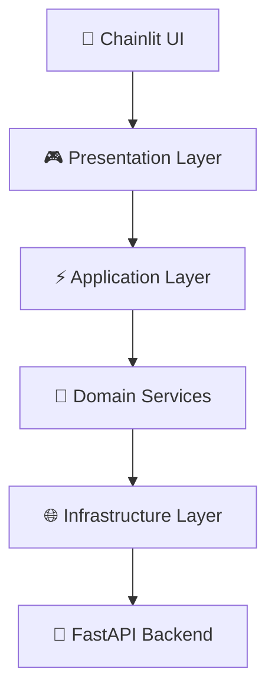

# 🎓 Chatbot RAG Universitas Gunadarma - Frontend

<div align="center">


[](https://chainlit.io)
[](https://github.com/psf/black)
[](https://blog.cleancoder.com/uncle-bob/2012/08/13/the-clean-architecture.html)

**Frontend aplikasi chatbot akademik dengan arsitektur RAG (Retrieval-Augmented Generation)**  
_Menyediakan antarmuka pengguna yang interaktif untuk asisten virtual Universitas Gunadarma_

[🚀 Demo](#-instalasi--menjalankan-lokal) •
[📚 Dokumentasi](#-referensi--dokumentasi) •
[🤝 Kontribusi](#-kontribusi) •
[🐛 Issues](https://github.com/maybeitsai/chatbot-rag-gunadarma-frontend/issues)

</div>

---

## 📋 Daftar Isi

- [📝 Tentang Proyek](#-tentang-proyek)
- [✨ Fitur Utama](#-fitur-utama)
- [🏗️ Arsitektur](#️-arsitektur)
- [🚀 Instalasi & Setup](#-instalasi--menjalankan-lokal)
- [⚙️ Konfigurasi](#️-konfigurasi-lanjutan)
- [🛠️ Development](#️-development--testing)
- [📁 Struktur Proyek](#-struktur-proyek)
- [🔧 Troubleshooting](#-troubleshooting)
- [🤝 Kontribusi](#-kontribusi)
- [📚 Referensi](#-referensi--dokumentasi)
- [📜 Lisensi](#-lisensi)

## 📝 Tentang Proyek

Repositori ini berisi **frontend** dari sistem chatbot akademik Universitas Gunadarma yang dibangun dengan **Clean Architecture**. Aplikasi ini menyediakan antarmuka pengguna yang intuitif untuk berinteraksi dengan sistem RAG (Retrieval-Augmented Generation) yang dapat menjawab pertanyaan seputar kehidupan akademik universitas.

### 🎯 Tujuan

- Menyediakan asisten virtual 24/7 untuk mahasiswa dan dosen
- Memberikan informasi akademik yang akurat dan terverifikasi
- Meningkatkan aksesibilitas informasi kampus
- Mengurangi beban kerja administratif melalui otomatisasi

## 📝 Deskripsi Proyek

Proyek ini bertujuan untuk menyediakan asisten virtual yang dapat diakses oleh mahasiswa dan dosen untuk mendapatkan informasi secara cepat dan akurat. Chatbot ini memanfaatkan model bahasa canggih (LLM) yang diperkaya dengan konteks dari basis data pengetahuan internal universitas, yang disimpan dalam sebuah vector database.

## ✨ Fitur Utama

### 🎨 **Antarmuka Pengguna**

- **UI Responsif**: Antarmuka yang bersih dan interaktif dengan **Chainlit**
- **Real-time Chat**: Percakapan langsung dengan respons instan
- **Source Citations**: Setiap jawaban menyertakan referensi ke dokumen sumber
- **Starter Questions**: Pertanyaan template untuk memulai percakapan

### 🔧 **Teknologi & Arsitektur**

- **Clean Architecture**: Struktur kode modular dengan separation of concerns
- **RAG Integration**: Komunikasi seamless dengan backend FastAPI
- **Caching System**: Sistem cache untuk performa optimal
- **Type Safety**: Type hints lengkap untuk development experience yang lebih baik
- **Error Handling**: Penanganan error yang robust dengan retry mechanism

### 🚀 **Performance & Scalability**

- **Async Processing**: Operasi asinkron untuk performa tinggi
- **Connection Pooling**: Manajemen koneksi yang efisien ke backend
- **Automatic Retries**: Retry otomatis dengan exponential backoff
- **Request Batching**: Dukungan batch processing untuk multiple queries

### 💻 **Developer Experience**

- **Hot Reload**: Development server dengan auto-reload
- **Environment Configuration**: Konfigurasi fleksibel melalui environment variables
- **Comprehensive Logging**: Sistem logging yang informatif
- **Easy Setup**: Instalasi mudah dengan `uv` package manager

## 🏗️ Arsitektur

### 📊 **Arsitektur Sistem**

Proyek ini menggunakan **Clean Architecture** dengan pemisahan yang jelas antara layer:



### 🔄 **Alur Komunikasi**

```
User Input → Chainlit UI → Chat Controller → Chat Use Case →
Search Service → RAG API Client → FastAPI Backend →
LangChain → PGVector + Gemini → Response Flow (reverse)
```

### 📦 **Clean Architecture Layers**

#### 🎮 **Presentation Layer** (`src/presentation/`)

- **Controllers**: Mengelola interaksi pengguna dan koordinasi use cases
- **Formatters**: Format response untuk tampilan yang optimal
- **Configuration**: Setup profil chat dan starter questions

#### ⚡ **Application Layer** (`src/application/`)

- **Use Cases**: Logika bisnis dan orchestration workflows
- **Services**: Domain services untuk operasi kompleks
- **DTOs**: Data transfer objects untuk komunikasi antar layer

#### 🏛️ **Domain Layer** (`src/domain/`)

- **Entities**: Objek bisnis utama (SearchResponse, ChatProfile)
- **Value Objects**: Immutable objects (SearchQuery, SearchResult)
- **Enums**: Konstanta domain (SearchStrategy, MessageType)

#### 🔧 **Infrastructure Layer** (`src/infrastructure/`)

- **API Clients**: Komunikasi dengan external services
- **Configuration**: Environment dan API configuration
- **Caching**: Implementation caching mechanism

### 🌐 **Teknologi Stack**

- **Frontend Framework**: [Chainlit](https://chainlit.io) - Modern chat UI
- **Backend Communication**: [httpx](https://www.python-httpx.org/) - Async HTTP client
- **Package Management**: [uv](https://github.com/astral-sh/uv) - Fast Python package manager
- **Code Quality**: [Black](https://black.readthedocs.io/) - Code formatter
- **Type Checking**: Python type hints dengan [Pydantic](https://pydantic.dev/)

## 🚀 Instalasi & Menjalankan Lokal

### 📋 **Prerequisites**

- **Python 3.12+** - [Download Python](https://www.python.org/downloads/)
- **Git** - [Install Git](https://git-scm.com/downloads)
- **Backend API** - Ikuti setup [chatbot-rag-gunadarma-backend](https://github.com/maybeitsai/chatbot-rag-gunadarma-backend)

### ⚡ **Quick Start**

#### 1️⃣ **Clone Repository**

```bash
git clone https://github.com/maybeitsai/chatbot-rag-gunadarma-frontend.git
cd chatbot-rag-gunadarma-frontend
```

#### 2️⃣ **Install UV Package Manager**

```powershell
# Windows PowerShell
powershell -c "irm https://astral.sh/uv/install.ps1 | iex"

# Restart terminal atau jalankan:
refreshenv
```

#### 3️⃣ **Setup Environment**

```bash
# Buat virtual environment
uv venv

# Install dependencies
uv sync

# Install chainlit tool
uv tool install chainlit
```

#### 4️⃣ **Environment Configuration**

```bash
# Copy template environment
cp .env.example .env

# Edit konfigurasi (opsional)
# Default backend URL: http://localhost:8000
```

#### 5️⃣ **Jalankan Aplikasi**

**Option A: Manual Start (Recommended untuk Development)**

```bash
# Terminal 1: Start Backend (lihat repository backend)
# ...

# Terminal 2: Start Frontend
uv run chainlit run app.py -w
```

**Option B: Auto Start dengan Script**

```bash
# Start kedua services sekaligus (jika tersedia)
./scripts/start-dev.sh  # Linux/Mac
.\scripts\start-dev.ps1  # Windows
```

#### 6️⃣ **Akses Aplikasi**

```
🌐 Frontend: http://localhost:8080
🔧 Backend API: http://localhost:8000
📚 API Docs: http://localhost:8000/docs
```

### 🔧 **Alternative Installation Methods**

<details>
<summary><strong>Docker Installation</strong></summary>

```bash
# Build dan jalankan dengan docker-compose
docker-compose up --build

# Atau build manual
docker build -t gunadarma-chatbot-frontend .
docker run -p 8080:8080 gunadarma-chatbot-frontend
```

</details>

<details>
<summary><strong>Traditional pip Installation</strong></summary>

```bash
# Buat virtual environment
python -m venv venv
source venv/bin/activate  # Linux/Mac
venv\Scripts\activate     # Windows

# Install dependencies
pip install -r requirements.txt

# Run aplikasi
chainlit run app.py -w
```

</details>

## ⚙️ Konfigurasi

### 🔐 **Environment Variables**

Buat file `.env` di root directory untuk konfigurasi:

```bash
# Backend API Configuration
FASTAPI_BACKEND_URL=http://localhost:8000

# Optional: Timeout settings
API_TIMEOUT=30.0
MAX_RETRIES=3
RETRY_DELAY=2.0

# Optional: Logging configuration
LOG_LEVEL=INFO
DEBUG_MODE=false

# Optional: Cache settings
CACHE_TTL=300
CACHE_MAX_SIZE=1000

# Optional: UI Configuration
CHAINLIT_PORT=8080
CHAINLIT_HOST=0.0.0.0
```

### 🛠️ **Advanced Configuration**

<details>
<summary><strong>Custom API Client Configuration</strong></summary>

```python
from src.infrastructure import ApiConfig
from src.infrastructure.api import RAGApiClient

# Custom configuration
config = ApiConfig(
    base_url="https://your-api.example.com",
    timeout=30.0,
    max_retries=5,
    retry_delay=2.0
)

client = RAGApiClient(config)
```

</details>

<details>
<summary><strong>Chainlit Configuration</strong></summary>

Edit `chainlit.toml`:

```toml
[project]
name = "Gunadarma RAG Chatbot"
description = "Chatbot akademik untuk Universitas Gunadarma"

[UI]
name = "Gunadarma Assistant"
show_readme_as_default = true
default_collapse_content = true

[features]
spontaneous_file_upload = true
```

</details>

<details>
<summary><strong>Cache Management</strong></summary>

```python
# Programmatic cache management
from src.infrastructure.cache import SimpleCache

cache = SimpleCache()

# Clear cache
cache.clear()

# Set custom TTL
cache.set("key", "value", ttl=600)  # 10 minutes

# Batch operations
cache.set_many({"key1": "val1", "key2": "val2"})
```

</details>

## 🛠️ Development & Testing

### 🎯 **Code Quality Standards**

Proyek ini mengikuti best practices:

- **PEP 8 Compliance** - Style consistency
- **Type Safety** - Type hints di semua functions dan methods
- **Clean Architecture** - Separation of concerns dengan dependency injection
- **Comprehensive Documentation** - Docstrings dan inline comments
- **Error Handling** - Robust error handling di setiap layer

### 🧪 **Development Tools**

```bash
# Code formatting dengan Black
uv run black .
uv run black --check .  # Check only

# Type checking dengan mypy
uv add --dev mypy
uv run mypy src/

# Linting dengan ruff
uv add --dev ruff
uv run ruff check .
uv run ruff check --fix .  # Auto-fix

# Import sorting dengan isort
uv add --dev isort
uv run isort .
```

### 🔧 **Development Scripts**

```bash
# Start development server
uv run chainlit run app.py -w

# Start with specific port
uv run chainlit run app.py -w --port 8081

# Production build (jika menggunakan Docker)
docker build -t gunadarma-frontend .

# Run tests (ketika test suite tersedia)
uv run pytest tests/
```

### 📊 **Performance Monitoring**

- **Response Times**: Monitor melalui Chainlit UI dan terminal logs
- **Cache Performance**: Track cache hit rates di application logs
- **Error Tracking**: Error rates dan stack traces dalam console output
- **Memory Usage**: Monitor dengan system tools atau APM solutions

### 🏗️ **Architecture for Testing**

Proyek ini dirancang untuk mendukung testing:

```python
# Dependency injection ready
from src.application.use_cases import ChatUseCase
from src.infrastructure.api import RAGApiClient

# Mock-friendly design
def test_chat_use_case():
    mock_api = MockRAGApiClient()
    use_case = ChatUseCase(mock_api)
    # Test logic here
```

### 🚀 **Contributing Guidelines**

1. **Fork** repository dan buat feature branch
2. **Follow** coding standards dan architecture patterns
3. **Add tests** untuk fitur baru (ketika test framework siap)
4. **Update documentation** sesuai perubahan
5. **Submit PR** dengan description yang jelas

<details>
<summary><strong>Setup Development Environment</strong></summary>

```bash
# Clone fork Anda
git clone https://github.com/YOUR_USERNAME/chatbot-rag-gunadarma-frontend.git
cd chatbot-rag-gunadarma-frontend

# Setup upstream remote
git remote add upstream https://github.com/maybeitsai/chatbot-rag-gunadarma-frontend.git

# Create feature branch
git checkout -b feature/your-feature-name

# Install development dependencies
uv sync --dev

# Install pre-commit hooks (jika tersedia)
uv tool install pre-commit
pre-commit install
```

</details>

## 🔧 Troubleshooting

### ❌ **Common Issues & Solutions**

<details>
<summary><strong>🚫 Port Conflict Errors</strong></summary>

**Problem**: `Port 8080 already in use`

**Solution**:

```bash
# Option 1: Use different port
uv run chainlit run app.py -w --port 8081

# Option 2: Kill process using port
# Windows
netstat -ano | findstr :8080
taskkill /PID <PID> /F

# Linux/Mac
lsof -ti:8080 | xargs kill -9
```

</details>

<details>
<summary><strong>🔌 Backend Connection Issues</strong></summary>

**Problem**: `Failed to connect to backend API`

**Solution**:

```bash
# Check if backend is running
curl http://localhost:8000/health
# atau
wget -qO- http://localhost:8000/health

# Update environment variable
echo "FASTAPI_BACKEND_URL=http://localhost:8001" >> .env

# Restart frontend
uv run chainlit run app.py -w
```

</details>

<details>
<summary><strong>📦 Package Installation Issues</strong></summary>

**Problem**: `uv sync` fails or packages missing

**Solution**:

```bash
# Clear UV cache
uv cache clean

# Reinstall everything
rm -rf .venv
uv venv
uv sync

# Alternative: Use pip
pip install -r requirements.txt
```

</details>

<details>
<summary><strong>🐍 Python Version Issues</strong></summary>

**Problem**: `Python version not supported`

**Solution**:

```bash
# Check Python version
python --version

# Use specific Python version with uv
uv venv --python 3.12

# Or install Python 3.12+
# Windows: winget install Python.Python.3.12
# Mac: brew install python@3.12
# Linux: apt update && apt install python3.12
```

</details>

<details>
<summary><strong>💾 Cache & Performance Issues</strong></summary>

**Problem**: Slow responses or stale data

**Solution**:

```python
# Clear application cache programmatically
from src.infrastructure.cache import SimpleCache
cache = SimpleCache()
cache.clear()

# Or restart application
# Ctrl+C then uv run chainlit run app.py -w
```

</details>

<details>
<summary><strong>🔧 Environment Variables Not Loading</strong></summary>

**Problem**: Configuration not applied

**Solution**:

```bash
# Check if .env file exists
ls -la .env

# Copy from example
cp .env.example .env

# Verify loading in Python
python -c "from dotenv import load_dotenv; load_dotenv(); import os; print(os.getenv('FASTAPI_BACKEND_URL'))"
```

</details>

### 🆘 **Getting Help**

1. **Check Issues**: [GitHub Issues](https://github.com/maybeitsai/chatbot-rag-gunadarma-frontend/issues)
2. **Create New Issue**: Include error logs dan system info
3. **Discussion**: [GitHub Discussions](https://github.com/maybeitsai/chatbot-rag-gunadarma-frontend/discussions)

### 📋 **Issue Report Template**

```markdown
**Environment:**

- OS: [Windows/Mac/Linux]
- Python: [version]
- UV: [version]

**Problem:**
[Describe the issue]

**Steps to Reproduce:**

1. [Step 1]
2. [Step 2]

**Expected Behavior:**
[What should happen]

**Actual Behavior:**
[What actually happens]

**Error Logs:**
```

[Paste error messages here]

```

```

## 📁 Struktur Proyek

```
frontend/
├── 📁 src/                          # Source code dengan Clean Architecture
│   ├── 🏛️ domain/                   # Domain Layer - Business entities
│   │   ├── __init__.py
│   │   ├── entities.py              # Core business objects
│   │   ├── value_objects.py         # Immutable value objects
│   │   └── enums.py                 # Domain constants
│   ├── ⚡ application/               # Application Layer - Use cases
│   │   ├── __init__.py
│   │   ├── services.py              # Domain services
│   │   └── use_cases.py             # Business use cases
│   ├── 🔧 infrastructure/           # Infrastructure Layer - External concerns
│   │   ├── __init__.py
│   │   ├── api.py                   # HTTP client implementations
│   │   ├── cache.py                 # Caching implementations
│   │   └── config.py                # Configuration management
│   ├── 🎮 presentation/             # Presentation Layer - UI logic
│   │   ├── __init__.py
│   │   ├── controllers.py           # Request/response handling
│   │   ├── formatters.py            # Response formatting
│   │   └── config.py                # UI configuration
│   ├── 🔗 core/                     # Core - Interfaces & exceptions
│   │   ├── __init__.py
│   │   ├── interfaces.py            # Abstract interfaces
│   │   └── exceptions.py            # Custom exceptions
│   └── __init__.py                  # Application bootstrap
├── 📁 public/                       # Static assets
│   ├── favicon.png                  # App favicon
│   ├── idea.svg                     # UI icons
│   ├── learn.svg
│   ├── question.svg
│   └── write.svg
├── 📁 .chainlit/                    # Chainlit configuration
│   └── config.toml
├── 🚀 app.py                        # Main application entry point
├── 📄 chainlit.md                   # Welcome page content
├── ⚙️ chainlit.toml                  # Chainlit settings
├── 🔒 .env.example                  # Environment template
├── 📦 pyproject.toml                # Project dependencies & metadata
├── 🔒 uv.lock                       # Dependency lock file
├── 📚 README.md                     # This file
├── 📜 LICENSE                       # MIT license
└── 🐳 docker-compose.yml            # Docker configuration
```

### 🏗️ **Clean Architecture Layers**

| Layer                 | Purpose                   | Dependencies               |
| --------------------- | ------------------------- | -------------------------- |
| **🏛️ Domain**         | Business rules & entities | None (pure business logic) |
| **⚡ Application**    | Use cases & workflows     | Domain only                |
| **🔧 Infrastructure** | External integrations     | Application, Domain        |
| **🎮 Presentation**   | UI logic & formatting     | Application, Domain        |
| **🔗 Core**           | Interfaces & contracts    | None (abstraction layer)   |

### 📊 **Dependency Flow**

```
Presentation → Application → Domain
       ↓            ↓
Infrastructure → Core (interfaces)
```

## 🤝 Kontribusi

Kami sangat menyambut kontribusi dari komunitas! Setiap kontribusi, baik kecil maupun besar, sangat dihargai.

### 🚀 **Quick Contribution Guide**

1. **🍴 Fork** repository ini
2. **🌿 Create branch** untuk fitur Anda (`git checkout -b feature/amazing-feature`)
3. **✨ Commit changes** (`git commit -m 'feat: add amazing feature'`)
4. **📤 Push** ke branch (`git push origin feature/amazing-feature`)
5. **🔄 Open Pull Request**

### 📝 **Contribution Guidelines**

#### **Code Standards**

```bash
# Format code sebelum commit
uv run black .
uv run isort .

# Check linting
uv run ruff check .

# Type checking
uv run mypy src/
```

#### **Commit Message Convention**

```
type(scope): description

Types:
- feat: New feature
- fix: Bug fix
- docs: Documentation
- style: Code style changes
- refactor: Code refactoring
- test: Testing
- chore: Maintenance

Examples:
- feat(ui): add dark mode toggle
- fix(api): handle timeout errors
- docs(readme): update installation guide
```

#### **Architecture Guidelines**

- **Follow Clean Architecture** principles
- **Maintain layer separation** - no shortcuts between layers
- **Add type hints** untuk semua functions dan methods
- **Write docstrings** untuk public APIs
- **Handle errors gracefully** dengan proper exception handling

### 🎯 **Areas Where You Can Contribute**

| Area                 | Skill Level  | Description                       |
| -------------------- | ------------ | --------------------------------- |
| 🐛 **Bug Fixes**     | Beginner     | Fix reported issues               |
| 📚 **Documentation** | Beginner     | Improve docs, add examples        |
| 🎨 **UI/UX**         | Intermediate | Enhance user interface            |
| ⚡ **Performance**   | Intermediate | Optimize caching, API calls       |
| 🧪 **Testing**       | Intermediate | Add unit tests, integration tests |
| 🏗️ **Architecture**  | Advanced     | Improve system design             |
| 🔒 **Security**      | Advanced     | Security enhancements             |

### 💡 **Ideas for Contributions**

- **Features**: Chat history, user preferences, export conversations
- **Performance**: Better caching strategies, connection pooling optimization
- **Testing**: Comprehensive test suite with pytest
- **DevOps**: CI/CD pipeline, automated deployment
- **Monitoring**: Logging improvements, metrics collection
- **Accessibility**: Screen reader support, keyboard navigation

### 🐛 **Bug Reports**

Found a bug? Please [create an issue](https://github.com/maybeitsai/chatbot-rag-gunadarma-frontend/issues/new) dengan:

- **Clear description** dari masalah
- **Steps to reproduce** the issue
- **Expected vs actual behavior**
- **Environment details** (OS, Python version, dll)
- **Error logs** jika ada

### 💬 **Feature Requests**

Ada ide fitur baru? [Start a discussion](https://github.com/maybeitsai/chatbot-rag-gunadarma-frontend/discussions) atau [create a feature request](https://github.com/maybeitsai/chatbot-rag-gunadarma-frontend/issues/new).

### 👥 **Code Review Process**

1. **Automated checks** harus pass (CI/CD pipeline)
2. **Manual review** oleh maintainers
3. **Testing** pada local environment
4. **Merge** setelah approval

### 🏆 **Recognition**

Kontributor akan:

- **Mentioned** dalam release notes
- **Thanked** dalam project documentation
- **Listed** dalam GitHub contributors

### 📞 **Getting Help**

- **GitHub Discussions**: General questions dan brainstorming
- **GitHub Issues**: Specific bugs atau feature requests
- **Code Review**: Feedback melalui pull request comments

---

**Thank you for contributing to Gunadarma RAG Chatbot! 🙏**

## 📚 Referensi & Dokumentasi

### 🔗 **Project Links**

- **🏠 Frontend Repository**: [chatbot-rag-gunadarma-frontend](https://github.com/maybeitsai/chatbot-rag-gunadarma-frontend)
- **⚙️ Backend Repository**: [chatbot-rag-gunadarma-backend](https://github.com/maybeitsai/chatbot-rag-gunadarma-backend)
- **🐛 Issues**: [Report Issues](https://github.com/maybeitsai/chatbot-rag-gunadarma-frontend/issues)
- **💬 Discussions**: [Community Discussions](https://github.com/maybeitsai/chatbot-rag-gunadarma-frontend/discussions)

### 📖 **Technical Documentation**

- **[Chainlit Documentation](https://docs.chainlit.io)** - Chat application framework
- **[FastAPI Documentation](https://fastapi.tiangolo.com)** - Backend API framework (untuk backend)
- **[LangChain Documentation](https://python.langchain.com)** - LLM orchestration (untuk backend)
- **[Clean Architecture Guide](https://blog.cleancoder.com/uncle-bob/2012/08/13/the-clean-architecture.html)** - Architecture principles

### 🛠️ **Tools & Libraries**

- **[UV Package Manager](https://github.com/astral-sh/uv)** - Fast Python package management
- **[Pydantic](https://pydantic.dev)** - Data validation dan type safety
- **[httpx](https://www.python-httpx.org/)** - Modern HTTP client
- **[Black](https://black.readthedocs.io/)** - Code formatting
- **[Ruff](https://docs.astral.sh/ruff/)** - Fast Python linter

### 🎓 **Learning Resources**

- **[Python Type Hints](https://docs.python.org/3/library/typing.html)** - Type safety best practices
- **[Async Programming](https://realpython.com/async-io-python/)** - Asynchronous Python guide
- **[Dependency Injection](https://python-dependency-injector.ets-labs.org/)** - DI patterns dalam Python
- **[REST API Design](https://restfulapi.net/)** - API design principles

### 🏛️ **Architecture References**

- **Domain-Driven Design** - Business logic organization
- **SOLID Principles** - Object-oriented design principles
- **Hexagonal Architecture** - Ports and adapters pattern
- **Clean Code** - Code quality best practices

---

### 📊 **Project Stats**


## 📜 Lisensi

Proyek ini dilisensikan di bawah **[MIT License](LICENSE)**.

```
MIT License

Copyright (c) 2025 Gunadarma RAG Chatbot Team

Permission is hereby granted, free of charge, to any person obtaining a copy
of this software and associated documentation files (the "Software"), to deal
in the Software without restriction, including without limitation the rights
to use, copy, modify, merge, publish, distribute, sublicense, and/or sell
copies of the Software, and to permit persons to whom the Software is
furnished to do so, subject to the following conditions:

The above copyright notice and this permission notice shall be included in all
copies or substantial portions of the Software.

THE SOFTWARE IS PROVIDED "AS IS", WITHOUT WARRANTY OF ANY KIND, EXPRESS OR
IMPLIED, INCLUDING BUT NOT LIMITED TO THE WARRANTIES OF MERCHANTABILITY,
FITNESS FOR A PARTICULAR PURPOSE AND NONINFRINGEMENT.
```

---

<div align="center">

**⭐ Jika proyek ini membantu Anda, berikan star di GitHub! ⭐**

Made with ❤️ for Universitas Gunadarma Academic Community

[🔝 Back to Top](#-chatbot-rag-universitas-gunadarma---frontend)

</div>
