# 🎓 Chatbot RAG Universitas Gunadarma - Frontend

<div align="center">


[](https://chainlit.io)
[](https://github.com/psf/black)
[](https://blog.cleancoder.com/uncle-bob/2012/08/13/the-clean-architecture.html)

**Antarmuka Pengguna untuk Sistem Chatbot Akademik Berbasis RAG (Retrieval-Augmented Generation)**  
*Proyek Penelitian Ilmiah untuk menyediakan asisten virtual yang interaktif dan informatif bagi komunitas akademik Universitas Gunadarma.*

</div>

---

## Abstrak

Akses terhadap informasi akademik yang cepat dan akurat merupakan tantangan umum di lingkungan universitas. Proyek penelitian ini mengusulkan pengembangan sistem chatbot cerdas menggunakan arsitektur **Retrieval-Augmented Generation (RAG)** untuk mengatasi masalah ini. Repositori ini secara spesifik berisi implementasi **Frontend** dari sistem tersebut, yang berfungsi sebagai antarmuka pengguna utama.

Aplikasi frontend ini dibangun menggunakan **Chainlit** dan menerapkan prinsip-prinsip **Clean Architecture** untuk memastikan kode yang modular, teruji, dan mudah dipelihara. Tujuannya adalah untuk menyediakan platform yang intuitif dan responsif bagi mahasiswa, dosen, dan staf untuk berinteraksi dengan asisten virtual, mendapatkan jawaban atas pertanyaan akademik, dan memverifikasi informasi melalui sumber dokumen yang terpercaya.

---

## 📚 Daftar Isi

- [✨ Fitur Utama](#-fitur-utama)
- [🏗️ Arsitektur Sistem](#️-arsitektur-sistem)
- [⚙️ Teknologi yang Digunakan](#️-teknologi-yang-digunakan)
- [🚀 Instalasi & Menjalankan Proyek](#-instalasi--menjalankan-proyek)
- [🔧 Konfigurasi](#-konfigurasi)
- [📁 Struktur Proyek](#-struktur-proyek)
- [🤝 Kontribusi](#-kontribusi)
- [📜 Lisensi](#-lisensi)

---

## ✨ Fitur Utama

- **Antarmuka Chat Interaktif**: UI yang modern, bersih, dan responsif dibangun dengan Chainlit.
- **Jawaban Berbasis Konteks**: Terintegrasi dengan backend RAG untuk memberikan jawaban yang relevan dengan data internal universitas.
- **Sitasi Sumber**: Setiap jawaban dilengkapi dengan tautan ke dokumen sumber, memungkinkan verifikasi informasi secara mandiri.
- **Pertanyaan Pembuka**: Menyediakan contoh pertanyaan untuk memandu pengguna memulai percakapan.
- **Arsitektur Bersih (Clean Architecture)**: Memisahkan logika bisnis dari detail implementasi, menghasilkan kode yang tangguh dan skalabel.
- **Operasi Asinkron**: Dibangun di atas `asyncio` untuk menangani beberapa permintaan pengguna secara efisien.
- **Penanganan Error & Retry**: Mekanisme coba-ulang (retry) otomatis dengan *exponential backoff* untuk komunikasi yang andal dengan backend.

## 🏗️ Arsitektur Sistem

Sistem ini dirancang dengan pemisahan yang jelas antara Frontend dan Backend. Frontend ini berfokus pada presentasi dan interaksi pengguna, sementara semua logika RAG yang kompleks ditangani oleh layanan backend.

### Diagram Arsitektur Tingkat Tinggi

```mermaid
graph TD
    subgraph Pengguna
        U(👩‍🎓 Mahasiswa/Dosen)
    end

    subgraph "Frontend (Proyek Ini)"
        C[🎨 Chainlit UI]
        L[Logic Layer]
    end

    subgraph "Backend Service"
        A[🚀 FastAPI API]
        R[⚙️ RAG Core]
        V[🧠 Vector DB]
        M[🤖 LLM API]
    end

    U -- Interaksi via Browser --> C
    C -- Kirim Pertanyaan --> L
    L -- HTTP Request --> A
    A -- Proses --> R
    R -- Retrieve --> V
    R -- Generate --> M
    M -- Respons --> R
    V -- Konteks --> R
    R -- Jawaban --> A
    A -- HTTP Response --> L
    L -- Tampilkan Jawaban --> C
```



### Clean Architecture Frontend

Frontend ini secara internal mengadopsi **Clean Architecture** untuk memisahkan tanggung jawab dan meningkatkan kualitas kode.


- **Domain Layer (`src/domain`)**: Lapisan terdalam yang berisi entitas bisnis inti, *value objects*, dan aturan bisnis yang tidak bergantung pada lapisan lain. Contoh: `SearchResponse`, `SearchQuery`.
- **Application Layer (`src/application`)**: Mengandung logika aplikasi spesifik (*use cases*) dan mengorkestrasi aliran data dari dan ke lapisan domain. Contoh: `ChatUseCase`.
- **Infrastructure Layer (`src/infrastructure`)**: Mengelola komunikasi dengan dunia luar, seperti memanggil API eksternal (backend), manajemen cache, dan konfigurasi. Contoh: `RAGApiClient`.
- **Presentation Layer (`src/presentation`)**: Bertanggung jawab untuk menampilkan data kepada pengguna dan menerima input dari pengguna. Dalam proyek ini, ini adalah logika yang terhubung langsung dengan Chainlit. Contoh: `ChatController`.

### Alur Data (Sequence Diagram)

Diagram berikut menunjukkan alur permintaan dari pengguna hingga kembali menjadi respons.

```mermaid
sequenceDiagram
    participant User as 👩‍🎓 Pengguna
    participant UI as 🎨 Chainlit UI (app.py)
    participant Controller as 🎮 ChatController
    participant UseCase as ⚡ ChatUseCase
    participant Service as 🔧 ChatbotService
    participant APIClient as 🌐 RAGApiClient
    participant Backend as 🚀 FastAPI Backend

    User->>+UI: Mengetik dan mengirim pesan
    UI->>+Controller: process_message(pesan)
    Controller->>+UseCase: process_user_message(pesan)
    UseCase->>+Service: process_message(pesan)
    Service->>+APIClient: search(query)
    APIClient->>+Backend: POST /api/v1/ask (HTTP Request)
    Backend-->>-APIClient: HTTP Response (JSON)
    APIClient-->>-Service: SearchResponse (Entity)
    Service-->>-UseCase: String (Jawaban)
    UseCase-->>-Controller: String (Jawaban)
    Controller-->>-UI: String (Jawaban Terformat)
    UI-->>-User: Menampilkan jawaban dan sumber
```



## ⚙️ Teknologi yang Digunakan

| Kategori             | Teknologi                                                              | Tujuan                                                 |
| -------------------- | ---------------------------------------------------------------------- | ------------------------------------------------------ |
| **Framework UI**     | [Chainlit](https://chainlit.io)                                        | Membangun antarmuka chat interaktif dengan cepat.      |
| **Klien HTTP**       | [httpx](https://www.python-httpx.org/)                                 | Komunikasi asinkron yang andal dengan backend.         |
| **Manajemen Paket**  | [uv](https://github.com/astral-sh/uv)                                  | Instalasi dependensi yang sangat cepat.                |
| **Validasi Data**    | [Pydantic](https://pydantic.dev/)                                      | Menjamin integritas data antar lapisan arsitektur.     |
| **Gaya Kode**        | [Black](https://black.readthedocs.io/)                                 | Menjaga konsistensi format kode secara otomatis.       |
| **Bahasa**           | Python 3.12+                                                           | Bahasa utama pengembangan.                             |
| **Deployment**       | [Docker](https://www.docker.com/)                                      | Kontainerisasi aplikasi untuk portabilitas.            |

## 🚀 Instalasi & Menjalankan Proyek

### Prasyarat

1.  **Python 3.12+**: [Unduh di sini](https://www.python.org/downloads/).
2.  **Git**: [Instal Git](https://git-scm.com/downloads).
3.  **Backend Aktif**: Pastikan layanan [chatbot-rag-gunadarma-backend](https://github.com/maybeitsai/chatbot-rag-gunadarma-backend) sudah berjalan.

### Langkah-langkah Instalasi

1.  **Clone Repositori**
    ```bash
    git clone https://github.com/maybeitsai/chatbot-rag-gunadarma-frontend.git
    cd chatbot-rag-gunadarma-frontend
    ```

2.  **Instal `uv` (Package Manager)**
    ```powershell
    # Windows (PowerShell)
    powershell -c "irm https://astral.sh/uv/install.ps1 | iex"
    # Linux / macOS
    curl -LsSf https://astral.sh/uv/install.sh | sh
    ```
    *Catatan: Anda mungkin perlu me-restart terminal setelah instalasi.*

3.  **Buat Virtual Environment & Sinkronisasi Dependensi**
    ```bash
    # Membuat virtual environment di folder .venv
    uv venv

    # Menginstal semua dependensi dari pyproject.toml
    uv sync
    ```

4.  **Konfigurasi Environment**
    Salin file contoh `.env.example` menjadi `.env`.
    ```bash
    cp .env.example .env
    ```
    Secara default, frontend akan mencoba terhubung ke backend di `http://localhost:8000`. Ubah nilai `BACKEND_URL` di dalam file `.env` jika backend Anda berjalan di alamat yang berbeda.

5.  **Jalankan Aplikasi Frontend**
    ```bash
    # -w (watch) akan me-reload server secara otomatis saat ada perubahan kode
    uv run chainlit run app.py -w
    ```

6.  **Akses Aplikasi**
    Buka browser dan navigasi ke **http://localhost:8080**.

### Opsi Instalasi Alternatif

<details>
<summary><strong>Menggunakan Docker</strong></summary>

Pastikan Docker sudah terinstal dan berjalan.

```bash
# Build dan jalankan container menggunakan docker-compose
docker-compose up --build

# Aplikasi akan tersedia di http://localhost:8080
```
</details>

<details>
<summary><strong>Menggunakan pip (Tradisional)</strong></summary>

```bash
# Buat dan aktifkan virtual environment
python -m venv .venv
# Windows
.venv\Scripts\activate
# Linux / macOS
source .venv/bin/activate

# Ekstrak dependensi dari pyproject.toml ke requirements.txt
uv pip freeze > requirements.txt

# Instal dependensi menggunakan pip
pip install -r requirements.txt

# Jalankan aplikasi
chainlit run app.py -w
```
</details>

## 🔧 Konfigurasi

Konfigurasi utama aplikasi diatur melalui variabel lingkungan (*environment variables*) dalam file `.env`.

```ini
# URL lengkap dari layanan backend FastAPI
BACKEND_URL=http://localhost:8000

# (Opsional) Konfigurasi klien HTTP
API_TIMEOUT=60.0       # Waktu tunggu maksimum untuk permintaan API (detik)
MAX_RETRIES=3          # Jumlah maksimum percobaan ulang jika permintaan gagal
RETRY_DELAY=1.0        # Waktu tunda awal sebelum mencoba lagi (detik)

# (Opsional) Konfigurasi logging
LOG_LEVEL=INFO         # Level logging (DEBUG, INFO, WARNING, ERROR)
```

## 📁 Struktur Proyek

Struktur direktori proyek ini dirancang untuk mengikuti prinsip **Clean Architecture**, memisahkan setiap lapisan dengan jelas.

```
.
├── 🚀 app.py                # Titik masuk utama aplikasi Chainlit
├── 📄 chainlit.md            # Konten Markdown untuk halaman pembuka
├── 🐳 Dockerfile             # Instruksi untuk membangun image Docker
├── 🐋 docker-compose.yml     # Konfigurasi untuk menjalankan dengan Docker Compose
├── 📝 pyproject.toml         # Metadata proyek dan daftar dependensi (untuk uv/pip)
├── 🔒 uv.lock                 # File lock untuk dependensi yang reproducible
├── 📄 .env.example           # Contoh file konfigurasi environment
├── 📁 public/                # Aset statis (gambar, ikon)
└── 📁 src/                   # Direktori utama kode sumber
    ├── 🏛️ domain/             # Lapisan Domain: Entitas & Aturan Bisnis Inti
    │   ├── entities.py
    │   ├── enums.py
    │   └── value_objects.py
    ├── ⚡ application/        # Lapisan Aplikasi: Use Cases & Logika Spesifik
    │   ├── services.py
    │   └── use_cases.py
    ├── 🔧 infrastructure/     # Lapisan Infrastruktur: Alat & Layanan Eksternal
    │   ├── api.py            # Klien untuk berkomunikasi dengan Backend API
    │   ├── config.py         # Manajemen konfigurasi
    │   └── cache.py          # (Jika ada) Logika caching
    ├── 🎮 presentation/       # Lapisan Presentasi: Logika terkait UI
    │   ├── controllers.py    # Menghubungkan input UI ke use cases
    │   └── formatters.py     # Memformat data untuk ditampilkan di UI
    └── 🔗 core/               # Abstraksi Inti: Interfaces & Exceptions
        ├── exceptions.py
        └── interfaces.py
```

## 🤝 Kontribusi

Kontribusi untuk meningkatkan proyek ini sangat kami hargai. Silakan buat *fork* dari repositori ini, buat *branch* baru untuk fitur atau perbaikan Anda, dan ajukan *Pull Request*.

## 📜 Lisensi

Proyek ini dilisensikan di bawah **[MIT License](LICENSE)**.